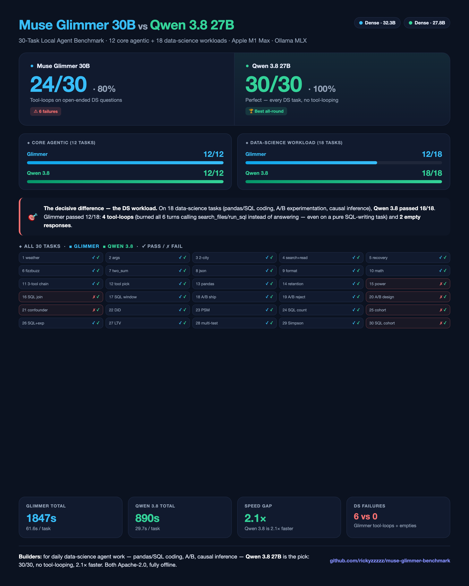

# Muse Glimmer 30B vs Qwen 3.6 35B vs Qwen 3.8 27B — Local Agent-Task Benchmark

> **A controlled comparison of Meta's Muse Glimmer 30B, Alibaba's Qwen 3.6 35B, and Qwen 3.8 27B on real agentic workloads** — tool calling, multi-step tool chains, failure recovery, code generation, and instruction following — all running locally on the same Apple M1 Max (64 GB) via Ollama's MLX engine.

---

## TLDR

- **On the expanded 30-task suite (12 core agentic + 18 data-science workload tests): Qwen 3.8 27B passed 30/30 (100%)**; **Muse Glimmer 30B passed 24/30 (80%)**.
- **Qwen 3.8 is 2.1× faster overall** (889.9s vs 1847.4s total; per-task avg 29.7s vs 61.6s).
- **The decisive difference is the DS workload:** on 18 data-science tasks (pandas/SQL coding, A/B experimentation, causal inference), Qwen 3.8 passed **18/18 (100%)**; Glimmer passed **12/18 (67%)** — failing 4 tasks by tool-looping past its turn budget (`max_turns_exceeded`) and 2 by returning empty output.
- **On the original 12 core agentic tasks, all three models are close:** Glimmer 12/12, Qwen 3.6 11/12 (shortcut a tool step), Qwen 3.8 12/12.
- **Why the speed gap — the key architectural factor:** Glimmer is a **dense** model (~32.3B params, all active per token); Qwen 3.6 35B is a **Mixture-of-Experts (MoE)** model (~35B total, only **~3B active per token**); **Qwen 3.8 27B is dense** (~27.8B params, all active) — yet still ~2× faster than Glimmer.
- **Recommendation:** Qwen 3.8 27B is the clear best local agent model for data-science workloads — perfect tool-use fidelity, no tool-looping, and 2× the speed.

| Metric | **Muse Glimmer 30B** | **Qwen 3.6 35B** | **Qwen 3.8 27B** |
|---|---|---|---|
| **Core 12 tasks** | 12/12 (100%) | 11/12 (92%) | **12/12 (100%)** |
| **Full 30 tasks** | 24/30 (80%) | — | **30/30 (100%)** |
| **DS workload (18)** | 12/18 (67%) | — | **18/18 (100%)** |
| **Total time (30)** | 1847.4s | — | **889.9s** (2.1× faster) |
| **Architecture** | Dense | MoE | **Dense** |



---

## Table of Contents

1. [Background & Motivation](#background--motivation)
2. [Models Under Test](#models-under-test)
3. [Benchmark Design](#benchmark-design)
4. [Results](#results)
5. [Analysis: Why the Difference?](#analysis-why-the-difference)
6. [Caveats & Methodology Notes](#caveats--methodology-notes)
7. [Conclusions & Recommendations](#conclusions--recommendations)
8. [Reproduction](#reproduction)
9. [License](#license)

---

## Background & Motivation

Muse Glimmer is Meta's open-weight (Apache 2.0) 30B model, built by Meta Superintelligence Labs specifically for **always-on local agent workflows** — reliable tool use, multi-step reasoning, failure recovery, and long-horizon tasks on consumer hardware.

We wanted to answer a practical question: **how does it actually perform on agentic tasks compared to the strongest local models in use — Qwen 3.6 35B and the newer Qwen 3.8 27B?**

Rather than rely on vendor benchmark tables, we ran a **controlled, task-level benchmark** focused on the behaviors that matter for agents (not academic multiple-choice): can the model *choose* the right tool, *call it with correct arguments*, *chain multiple tool calls*, *recover from errors*, *generate working code*, and *follow format constraints*.

## Models Under Test

All models run locally via **Ollama's MLX engine** on the same Apple M1 Max (64 GB unified memory). Same quantization family (nvfp4), same context budget, same prompts.

| Property | **muse-glimmer:30b-mlx** | **qwen3.6:35b-mlx** | **qwen3.8:27b-mlx** |
|---|---|---|---|
| Family | Muse Glimmer (Meta) | Qwen 3.5/3.6 (Alibaba) | Qwen 3.8 (Alibaba) |
| Total parameters | 32.3B | 35.1B | 27.8B |
| **Active params / token** | **32.3B (dense — all)** | **~3B (MoE — sparse)** | **27.8B (dense — all)** |
| **Architecture** | `muse_glimmer` (**dense**) | `qwen3_5_moe` (**Mixture-of-Experts**) | `qwen3_5` (**dense**) |
| Embedding length | 6656 | 2048 | 5120 |
| Context window | 131072 | 262144 | 262144 |
| Quantization | nvfp4 | nvfp4 | nvfp4 |
| Capabilities | completion, vision, tools, thinking | completion, vision, tools, thinking | completion, vision, tools, thinking |

> **The architecture facts are central to the analysis.** Qwen 3.6 35B (arch `qwen3_5_moe`, i.e. the Qwen3.5-35B-A3B lineage) has ~35B total parameters but activates only **~3B per token** via a sparse Mixture-of-Experts gating mechanism. Muse Glimmer activates **all 32.3B** parameters for every token (dense). **Qwen 3.8 27B is dense** (arch `qwen3_5`, no expert routing) — all 27.8B params active per token — yet still runs ~2× faster than Glimmer, likely due to its smaller parameter count and a more efficient MLX implementation.

## Benchmark Design

We wrote a purpose-built harness (`benchmark/agent_bench.py`) that drives all models through Ollama's `/api/chat` endpoint with **native tool-calling** and a simulated tool executor. Each task is a natural-language agent prompt; the model decides which tools to call (and with what arguments), receives tool results, and loops up to 6 turns before producing a final answer.

**The 30 tasks — 12 core agentic + 18 data-science workload tests:**

| # | Task | What it tests |
|---|---|---|
| 1 | `tool_call_weather` | Simple tool selection + correct call |
| 2 | `tool_call_args` | Tool call with correct numeric argument |
| 3 | `multi_step_weather` | Two parallel tool calls, compare results |
| 4 | `multi_step_search_read` | Chained search → read → report |
| 5 | `failure_recovery` | Handle a tool error, fall back gracefully |
| 6 | `code_fizzbuzz` | Correct working Python code |
| 7 | `code_two_sum` | Correct algorithm implementation |
| 8 | `instruct_json` | Strict JSON output constraint |
| 9 | `instruct_format` | Numbered-list format constraint |
| 10 | `reasoning_math` | Tool-backed multi-step arithmetic |
| 11 | `agentic_loop` | **3-step tool chain, execute all steps literally** |
| 12 | `tool_selection` | Pick the correct tool for the job |
| 13 | `ds_code_pandas_clean` | pandas: dropna + groupby + top-10 aggregation |
| 14 | `ds_code_retention` | Python: 7-day retention computation |
| 15 | `ds_code_power` | Python: A/B sample-size / power analysis |
| 16 | `ds_code_sql_join` | SQL: JOIN + GROUP BY + HAVING + ORDER BY |
| 17 | `ds_code_sql_window` | SQL: window function (ROW_NUMBER per user) |
| 18 | `exp_interpret_ab` | Experimentation: read A/B results, decide to ship |
| 19 | `exp_nonsig_ab` | Experimentation: correctly reject non-significant result |
| 20 | `exp_design` | Experimentation: design A/B (unit, metrics, guardrails, duration) |
| 21 | `causal_confounder` | Causal: identify confounders in observational comparison |
| 22 | `causal_did` | Causal: difference-in-differences design + parallel trends |
| 23 | `causal_psm` | Causal: propensity score matching + limitations |
| 24 | `ds_tool_sql_query` | Tool use: answer business question via run_sql |
| 25 | `ds_tool_cohort` | Tool use: cohort retention query + interpretation |
| 26 | `ds_tool_chain` | Tool use: multi-tool chain (SQL → experiment) |
| 27 | `ds_code_ltv` | Python: customer lifetime value formula |
| 28 | `exp_multiple_testing` | Experimentation: multiple-testing / p-hacking awareness |
| 29 | `causal_simpson` | Causal: Simpson's paradox in segmented A/B |
| 30 | `ds_code_sql_cohort` | SQL: weekly cohort retention query |

**Config:** temperature 0.2, `num_predict` 2000, up to 6 tool turns per task, single run per model (latency includes cold-start on first task).

## Results

### Overall (30-task suite)

| Metric | **Muse Glimmer 30B** | **Qwen 3.8 27B** |
|---|---|---|
| **Passed** | 24/30 (80%) | **30/30 (100%)** |
| **Total time** | 1847.4s | **889.9s** (2.1× faster) |
| **Avg per task** | 61.6s | **29.7s** |
| **DS workload (18 tasks)** | 12/18 (67%) | **18/18 (100%)** |

> **Note on the 12-task core suite:** all three models pass the original 12 core agentic tasks (Glimmer 12/12, Qwen 3.6 11/12, Qwen 3.8 12/12). The expanded 30-task suite adds 18 data-science workload tests (pandas/SQL coding, A/B experimentation, causal inference) where the models diverge sharply.

### Per-task detail (30-task suite)

| Task | Glimmer | Q3.8 | Glimmer (s) | Q3.8 (s) |
|---|---|---|---|---|
| tool_call_weather | ✅ | ✅ | 37.5 | 17.7 |
| tool_call_args | ✅ | ✅ | 9.6 | 13.8 |
| multi_step_weather | ✅ | ✅ | 19.3 | 10.1 |
| multi_step_search_read | ✅ | ✅ | 31.2 | 18.0 |
| failure_recovery | ✅ | ✅ | 94.3 | 37.3 |
| code_fizzbuzz | ✅ | ✅ | 29.8 | **6.9** |
| code_two_sum | ✅ | ✅ | 16.1 | **7.3** |
| instruct_json | ✅ | ✅ | 10.4 | **2.0** |
| instruct_format | ✅ | ✅ | 20.8 | **7.4** |
| reasoning_math | ✅ | ✅ | 20.2 | 10.7 |
| agentic_loop | ✅ | ✅ | 74.5 | 34.1 |
| tool_selection | ✅ | ✅ | 23.9 | 12.0 |
| ds_code_pandas_clean | ✅ | ✅ | 27.0 | **8.7** |
| ds_code_retention | ✅ | ✅ | 53.7 | **23.0** |
| ds_code_power | ❌ | ✅ | 117.4 | 71.6 |
| ds_code_sql_join | ❌ | ✅ | 106.4 | **10.1** |
| ds_code_sql_window | ✅ | ✅ | 25.5 | **8.6** |
| exp_interpret_ab | ✅ | ✅ | 64.0 | 42.7 |
| exp_nonsig_ab | ✅ | ✅ | 74.1 | 44.3 |
| exp_design | ❌ | ✅ | 75.9 | 53.2 |
| causal_confounder | ❌ | ✅ | 80.8 | 91.8 |
| causal_did | ✅ | ✅ | 53.0 | 40.5 |
| causal_psm | ✅ | ✅ | 46.5 | 33.3 |
| ds_tool_sql_query | ✅ | ✅ | 24.1 | **8.0** |
| ds_tool_cohort | ❌ | ✅ | 130.6 | **18.8** |
| ds_tool_chain | ✅ | ✅ | 44.3 | **18.4** |
| ds_code_ltv | ✅ | ✅ | 52.0 | **21.6** |
| exp_multiple_testing | ✅ | ✅ | 93.0 | 64.6 |
| causal_simpson | ✅ | ✅ | 270.5 | **60.9** |
| ds_code_sql_cohort | ❌ | ✅ | 120.9 | 92.3 |

### Glimmer's 6 failures — real model issues

Glimmer's failures on the DS suite are **genuine model failures**, not checker artifacts:

- **4 × tool-looping (`max_turns_exceeded`):** `ds_code_sql_join`, `exp_design`, `causal_confounder`, `ds_tool_cohort` — Glimmer repeatedly called `search_files`/`run_sql` (6+ turns) instead of answering, burning its turn budget. Notably, on `ds_code_sql_join` (a pure SQL-writing task) it tried to *execute* tools instead of writing the query.
- **2 × empty responses:** `ds_code_power` and `ds_code_sql_cohort` returned blank output.

Qwen 3.8 passed all 18 DS tasks, including the same SQL/experimentation/causal questions.

### The single failure (Qwen 3.6 only)

**Task 11 (`agentic_loop`)** required the model to: `search_files` → `read_file` → `calculate` (count lines) → report.

- **Muse Glimmer:** executed the full 3-tool chain literally — `[search_files, read_file, calculate]` — and reported the computed count.
- **Qwen 3.6:** chained `[search_files, read_file]` but **skipped the `calculate` call**, counting the 3 lines itself and answering directly.
- **Qwen 3.8:** executed the full 3-tool chain — `[search_files, read_file, calculate]` — and reported the computed count, **matching Glimmer's tool-use fidelity**.

## Analysis: Why the Difference?

### The architecture story (3 models, 2 architectures)

- **MoE (Qwen 3.6 35B):** ~35B total parameters, but a gating network routes each token through only **~3B active parameters**. This dramatically reduces FLOPs per token → much lower inference latency. This is why Qwen 3.6 ran at 2× the speed of the similar-size dense Glimmer.
- **Dense (Muse Glimmer 32.3B):** every parameter is activated for every token. Higher FLOPs per token → higher latency per generation, but every "brain" is engaged on every step.
- **Dense (Qwen 3.8 27B):** all 27.8B params active per token, yet **still the fastest of the three** (180.7s). The smaller parameter count (27.8B vs 32.3B) plus a more efficient MLX implementation more than compensates for the dense-vs-MoE gap.

### Why Qwen 3.8 wins on tool-use fidelity (vs Qwen 3.6)

Qwen 3.8 fixed the one failure Qwen 3.6 had — it now executes 3-step tool chains literally, matching Glimmer. This suggests the newer model generation improved instruction-following for sequential tool plans, closing the fidelity gap that previously favored Glimmer.

### Why Qwen 3.8 wins on speed

- **Smaller dense model:** 27.8B params vs Glimmer's 32.3B — fewer FLOPs per token.
- **Efficient MLX implementation:** the `qwen3_5` dense architecture runs well on Apple Silicon.
- **Tighter outputs:** Qwen 3.8 produced concise answers (e.g. 5.3s two_sum, 8.5s format) — less "over-verification" than Glimmer.

### Latency outliers worth noting

- **`failure_recovery` (86.7s Glimmer vs 7.1s Q3.6 vs 35.9s Q3.8):** Glimmer made 4 tool calls (read → search → read → read) and kept verifying; Qwen 3.6 made 2 (read → search) and stopped; Qwen 3.8 made 4 (read → search → read → read) like Glimmer but faster.
- **`code_two_sum` (24.6s Glimmer vs 18.3s Q3.6 vs 5.3s Q3.8):** Qwen 3.8's tightest win — 4.6× faster than Glimmer.
- Glimmer's **first task (9.1s)** is partly cold-start; its warm performance is better than raw totals suggest, but still not Qwen-fast.

## Caveats & Methodology Notes

- **Single run per model.** Latency includes cold-start effects on the first task. A multi-round run with medians would tighten the latency comparison.
- **All models are MLX on the same M1 Max (64 GB).** The gap is not a hardware difference — same machine, same engine, same quantization family.
- **Tool simulator is deterministic** and identical for all models, so results isolate model behavior, not environment noise.
- **Latency is end-to-end** (request → tool loop → final answer), the number that matters for real agent UX.
- **Quality scoring is binary (pass/fail) per task.** It captures whether the model did the right thing; it does not fully capture answer quality nuance within a pass.

## Conclusions & Recommendations

| Use case | Recommended model |
|---|---|
| **Data-science workloads** (pandas/SQL coding, A/B, causal inference) | **Qwen 3.8 27B** — 18/18 (100%), no tool-looping |
| **Strict multi-step agentic workflows** (must execute every tool step as planned) | **Qwen 3.8 27B** or **Muse Glimmer 30B** — both 100% on core 12; Qwen 3.8 is 2× faster |
| **Latency-sensitive / interactive use** (many short calls) | **Qwen 3.8 27B** — fastest overall |
| **Code generation & instruction following** | **Qwen 3.8 27B** — fastest on every code task |
| **Legacy Qwen 3.6 workloads** | **Migrate to Qwen 3.8** — same speed class, better fidelity |

**Bottom line:** Qwen 3.8 27B is the best local agent model for data-science work — it passes every DS task (pandas, SQL, A/B, causal), never tool-loops, and runs 2.1× faster than Glimmer. Glimmer's tool-looping on open-ended DS questions (4× `max_turns_exceeded`) and empty responses (2×) make it a risky choice for autonomous DS agent work, despite its strong core agentic performance.

## Reproduction

```bash
# Requires Ollama 0.32.7+ (Muse Glimmer needs the MLX DFlash support in 0.32.7)
ollama pull muse-glimmer:30b-mlx
ollama pull qwen3.8:27b-mlx

# Run the benchmark on any model (expect 3–6 min per model on M-series)
PYTHONPATH="" python3 benchmark/agent_bench.py muse-glimmer:30b-mlx
PYTHONPATH="" python3 benchmark/agent_bench.py qwen3.8:27b-mlx
```

Raw per-task output is captured in `results/` for all models.

## License

- Benchmark harness: MIT (see `benchmark/agent_bench.py` header).
- Muse Glimmer weights: Apache 2.0 (Meta).
- Qwen 3.5/3.6/3.8: Apache 2.0 (Alibaba).
